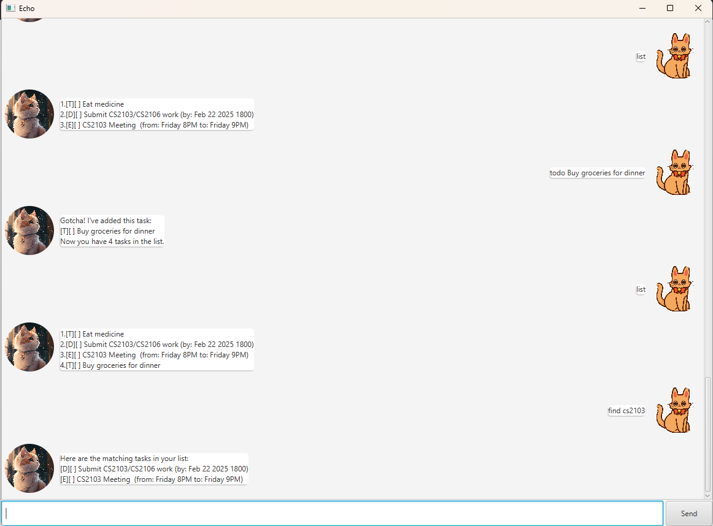

# Echo User Guide



Welcome to Echo – Your Personal Task Manager! ^_^  
Echo is a desktop app for managing your tasks. You will be able to add tasks (todo, deadline, event) as you need.

## Features

- [Todo](#adding-todo)
- [Deadline](#adding-deadlines)
- [Events](#adding-events)
- [Find task](#searching-or-task)
- [Mark task](#marking-task)
- [Unmark task ](#unmarking-task)
- [Prevent duplicate](#preventing-duplicates)

### Adding Todo 
To add a todo task, use the following command  
`todo <description>`  

#### Example  
`todo Buy groceries for dinner`  
This will add a todo task with the description "Buy groceries for dinner"  

#### Expected output
```
Gotcha! I've added this task:
[T][] Buy groceries for dinner
Now you have 1 tasks in the list.
```
### Adding deadlines
To add a deadline task, use the following command  
`deadline <description> /by <DD/MM/YYYY HHMM>`  

#### Example 
`deadline Finish CS2103 work /by 19/02/2025 1800`  
This will add a deadline task with the description "Finish CS2103 work", due on 19 February 2025 at 1800

#### Expected output  
```
Gotcha! I've added this task:
[D][] Finish CS2103 work (by: Feb 19 2025 1800)
Now you have 1 tasks in the list.
```

### Adding events
To add an event task, use the following command  
`event <description> /from <start> /to <end>`  

#### Example 
`event Team meeting /from Monday 2PM /to Monday 4PM`  
This will add a event task with the description "Team meeting", from Monday 2pm to Monday 4PM

#### Expected output  
```
Gotcha! I've added this task:
[E][] Team meeting (from: Monday 2PM to: Monday 4PM)
Now you have 1 tasks in the list.
```
<p></p>
### Searching of Task
To find a task, use the following command.  
`find <string>`  
Note: The output will list all tasks that match the provided string

#### Example 
`find CS2103`  
This will find "CS2103" from your task list. If it exist in the list, it will return the task.

#### Expected output
```
Here are the matching tasks in your list:
[D][] Finish CS2103 work (by: Feb 19 2025 1800)
[T][] CS2103 revision session
```

### Listing down tasks
To view all your tasks, use the following command  
`list`  
Note: This will list all your tasks in the order that you entered them

#### Example 
`list`

#### Expected output
```
Here are the matching tasks in your list:
[D][] Finish CS2103 work (by: Feb 19 2025 1800)
[T][X] CS2103 revision session
[T][] Buy groceries for dinner
```

### Marking Task
To mark a task as completed, use the following command  
`mark <task number>`  
Note: This will mark the task based on the number shown in the task list

#### Example 
`mark 1`

#### Expected output
```
Nice! Marked!
[D][X] Finish CS2103 work (by: Feb 19 2025 1800)
```

### Unmarking task
To unmark a task as completed, use the following command  
`unmark <task number>`  
Note: This will unmark the task based on the number shown in the task list

#### Example 
`unmark 1`

#### Expected output
```
OK, I've marked this task as not done yet.
[D][] Finish CS2103 work (by: Feb 19 2025 1800)
```

### Preventing duplicates
When adding a new task, the system will check if a task with the same description exists in the task list. If it exists, it will notify you with a duplicate message.

#### Example 
Suppose your task list contains the following  
`[D][] Finish CS2103 work (by: Feb 19 2025 1800)`

If the following command is submitted  
`todo Finish CS2103`  

The system will detect that a task with the same description exist and will return the following output  
`This is a duplicate!!!`